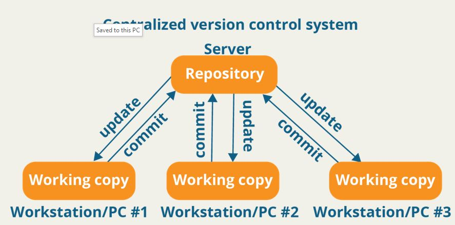
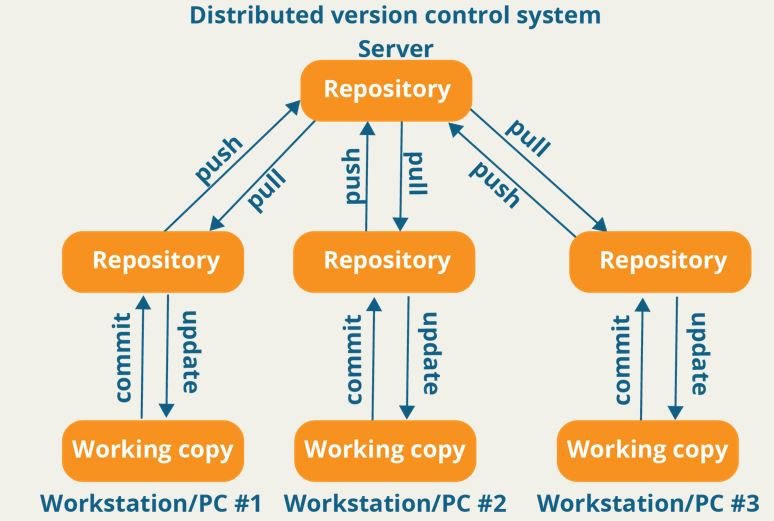

# Introduction Git
Git adalah Version Control System. Git bukan satu-satunya VCS di dunia kita. 

Ada beberapa VCS populer :
1. VCS terpusat 
- Subversion (svn)
- CVS (cvs)
- Perforce
2. VCS yang didistribusikan
- Git (git)
- Mercurial (hg)
- Bazaar (bzr)

Alasan lain untuk menggunakan VCS (atau git)?
* Lacak riwayat aplikasi
* Kembalikan ke versi tertentu
* Salahkan seseorang
* Collaborations
* Easy to deploy applications
* Safer than without VCS

Git Perintah Paling Umum :
- git **init** -> Inisialisasi repositori git
- git **clone** -> Mengkloning repositori yang ada
- git **status** -> Periksa status repositori git
- git **add** -> Tambahkan file yang diubah di folder kerja ke area pementasan
- git **commit** -m "message" -> Catat perubahannya
- git **log** -> Lihat riwayat komit
- git **pull** -> Dapatkan perubahan dari repositori jarak jauh
- git **push** -> Dorong perubahan ke repositori jarak jauh
- git **remote** -> Konfigurasikan repositori jarak jauh

Latihan : Basic Flow
1. Clone repository from remote repository : git clone nama_repositori.
2. Initialize a project : git init
3. Create .gitignore file : touch .gitignore
4. Add all files into staging : git add .
5. Commit with meaningful message : git commit -m 'Initial Commit'
6. Push to remote repository : git push origin master

Exercise 3: Handle Some Conflicts
1. Create new branch from master branch : git checkout -b rinu
2. Make some changes : tambahkan baris ini di file IntroGit.md lalu save file.
3. Commit with meaningful message : perintahnya git add . lalu git commit -m 'Added Exercise 3'
4. Push : perintahnya git push origin rinu
5. Create a merge request (or pull request) : buka https://github.com/rinusantoro/refactory-bootcamp/pulls klik New pull request -> Klik Compare branch amas -> Klik Create pull request.
6. Another person will do the same thing (repeat step 1 to 5)
7. Merge, and handle the conflicts

 

